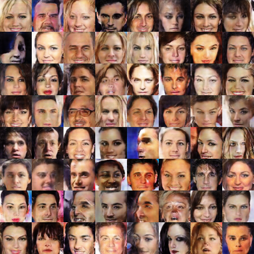

# DCGAN in TensorLayer

This is the TensorLayer implementation of [Deep Convolutional Generative Adversarial Networks](http://arxiv.org/abs/1511.06434).

- This project is for learning purpose only, so quality of work is not assured.

    
## Result on celebA

<a href="http://tensorlayer.readthedocs.io">

	

</a>
